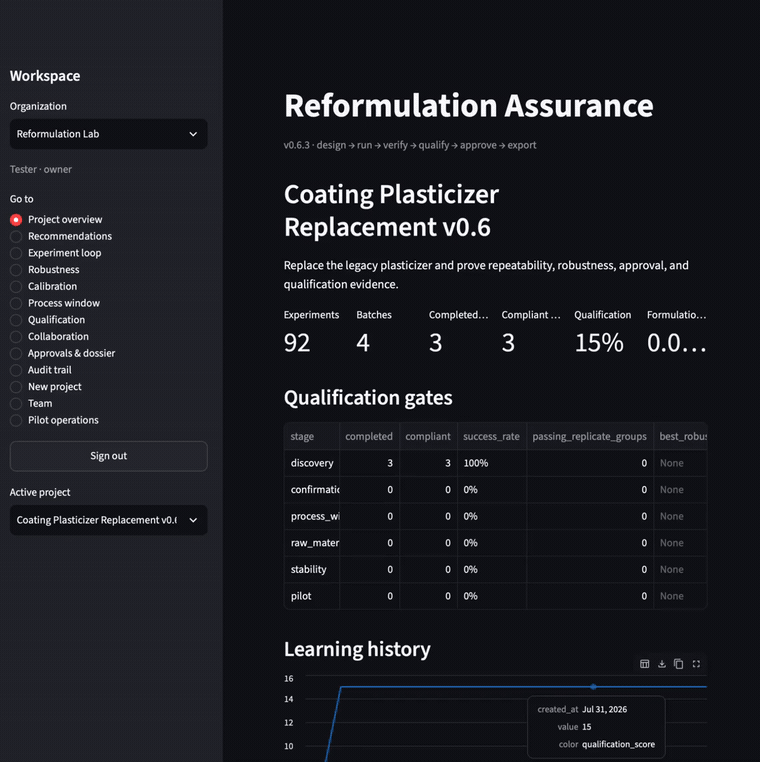
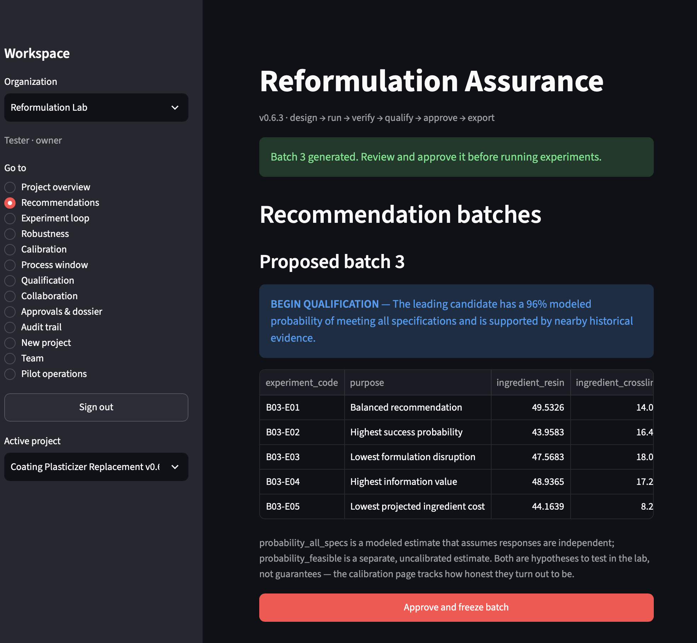
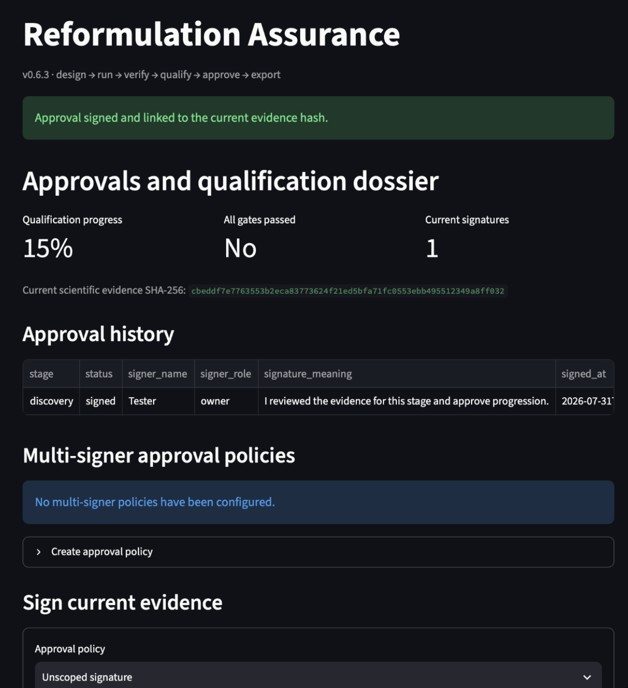

# Reformulation Assurance

**Replace an ingredient without breaking the product — and leave an audit trail a skeptic can check.**

When an ingredient gets discontinued or restricted, proving the replacement works isn't optional — someone has to defend that result later. Run the project in here and the proof assembles itself.

**[▶ Try the live demo in your browser](https://reformulation-assurance-demo.streamlit.app/)** — nothing to install, a cosmetics reformulation project preloaded, one click to enter. It's a shared public sandbox that resets periodically, so never put real formulas in it. (First load can take ~30 seconds if the app is waking up.)

Reformulation Assurance is an open-source, local-first workbench for ingredient-replacement projects in formulated products: coatings, adhesives, sealants — anything mixed to a specification. It takes a team from "our supplier discontinued this plasticizer" to a qualified replacement, with every experiment, model prediction, approval, and decision recorded along the way.

It runs entirely on your machine. Your formulations live in a SQLite file you own. Nothing is uploaded anywhere, there is no telemetry, and there is no cloud account — which matters, because formulations are usually the most confidential thing a company has.







## What it does

The core loop:

1. **Import history** — your past experiments from CSV or Excel: ingredient percentages, process conditions, measured results, including failed and incomplete runs (failures are evidence too).
2. **Model** — Gaussian-process and random-forest models learn how your ingredients and process variables drive each specification.
3. **Recommend** — the platform proposes a small, diverse batch of experiments, each with a stated purpose: best overall trade-off, highest modeled success, smallest change from your proven formula, most informative, lowest cost. Every candidate carries predictions, uncertainty, and extrapolation warnings.
4. **Run and record** — you run the experiments in your lab and enter results. The models retrain after every result.
5. **Qualify** — staged gates take a promising candidate through confirmation replicates, process-window studies, and supplier-lot variation, with robustness checked by Monte Carlo simulation of manufacturing variation.
6. **Approve and export** — approvals are electronic signatures bound to a SHA-256 hash of the exact evidence they were signed against; if the evidence changes, the mismatch is visible. One click exports an audit-ready dossier: every experiment, prediction, calibration record, approval, and the audit trail, with checksums.

The part most tools skip is the honesty loop: predictions are frozen at recommendation time and scored against your actual lab results later — error, interval coverage, Brier scores — so the platform builds a track record you can check instead of asking for trust.

## Who it's for

Small and mid-size formulation teams who live in spreadsheets and just got forced into a reformulation: a discontinued raw material, a restricted substance (PFAS-style regulation), a cost blowout, or a second-supplier qualification. If you have roughly 15–200 historical experiments and no data-science team, this is aimed at you.

## Quickstart (about 10 minutes)

Requires Python 3.11+.

```bash
git clone <this-repo>
cd reformulation-assurance
python3 -m venv .venv
source .venv/bin/activate        # Windows: .venv\Scripts\activate
python -m pip install -r requirements.txt
python -m streamlit run app.py
```

Your browser opens `http://localhost:8501`. The first account you create becomes the workspace owner.

Then take the built-in tour — no data needed:

1. **New project → Start with demo → Create v0.6 demo project.** You get a coatings project preloaded with completed and failed historical trials.
2. **Recommendations → Generate next batch.** Model fitting takes ~30–60 seconds. You'll get five candidates with different purposes, predictions, uncertainty, and a plain-language note about what the probabilities do and don't mean.
3. **Approve and freeze batch**, then go to **Experiment loop**, mark an experiment completed, and enter plausible numbers (e.g. adhesion 8.5, viscosity 2300, dry time 35, gloss 90). Watch the models retrain.
4. Open **Approvals & dossier**: the evidence hash has changed because the evidence did. Sign the discovery stage (it re-authenticates you and binds the signature to that exact hash), then export the dossier and look inside the zip.

To run the test suite (29 tests):

```bash
python -m unittest discover -s tests
```

## Using your own data

Two example datasets ship with the repo if you want to try the import wizard first: `demo_coatings_reformulation.csv` (replacing a legacy plasticizer in a coating — same scenario as the built-in demo) and `demo_cosmetics_emulsifier_swap.csv` (replacing a legacy PEG emulsifier in an oil-in-water lotion, with viscosity, pH, stability, and spreadability specs). Import either through **New project → Import your CSV**.

Bring a CSV or Excel sheet where each row is one experiment:

- **Ingredient columns** (they should sum to a fixed total, e.g. 100)
- **Process columns** (temperatures, times, speeds)
- **Categorical columns** (supplier family, equipment id) — optional
- **Response columns** (the properties you measure against specs)
- **Status column** (completed / failed / infeasible…) — optional but valuable

**New project → Import your CSV** walks you through mapping columns, setting mixture bounds, choosing the ingredient to remove, and defining specifications. A readiness report flags missing values, duplicates, and impossible totals before anything is modeled.

## Single-question tools (no install)

Two standalone one-page tools answer questions formulators hit mid-experiment. Each runs entirely in your browser — no account, nothing uploaded, view-source friendly:

- **[Baseline Drift Checker](https://tm289012.github.io/reformulation-assurance/drift-checker.html)** — paste time-ordered measurements of anything that should be stable (a control batch, a reference standard, an instrument baseline) and get an XmR-chart verdict: routine noise, or a shift/drift worth investigating.
- **[Replicate Noise Checker](https://tm289012.github.io/reformulation-assurance/replicate-checker.html)** — paste a few replicates of formula A and formula B and learn whether the difference is real, suggestive, or inside your noise — plus the smallest difference your replicate count could even detect.

## What the numbers mean (and don't)

This project prefers honest labels over impressive ones. The short version:

- `probability_all_specs` is a modeled joint probability that assumes responses are independent given the inputs. Correlations are not modeled.
- The feasibility estimate is a separate, uncalibrated classifier and is never blended into anything labeled a probability.
- Candidate generation is model-ranked random search over the bounded mixture space — not Bayesian optimization, and it says so.
- Backtests cross-validate the same model construction that gets deployed, hyperparameter fitting included.
- The calibration pages exist so the platform can be caught being wrong: frozen predictions vs. actual results, at run level and formulation level.

The full disclosure, including known weaknesses, is in [MODELING_NOTES.md](MODELING_NOTES.md). If you're a formulator or statistician and can find a problem that isn't already listed there, please open an issue — that's exactly the feedback this project wants.

## What this is not

This is a pilot-stage prototype, and the boundaries are stated rather than implied:

- Not a validated quality system, and signatures are internal approval records — no FDA 21 CFR Part 11 or EU Annex 11 claims.
- No SSO or MFA; authentication is local (PBKDF2, rate-unlimited) and suitable for a single trusted team, not the open internet.
- SQLite single-instance by design. Do not put it on a public server.
- Decision support only: qualified professionals remain responsible for chemical safety, regulatory review, physical execution, and final product approval.
- Stability studies and pilot/scale-up designers are planned but not built ([PRODUCT_ROADMAP.md](PRODUCT_ROADMAP.md)).

## Project layout

- `app.py` — Streamlit interface
- `reformulation_engine.py` — candidate generation, models, scoring
- `closed_loop.py` — retraining loop and qualification gates
- `assurance_v4.py` — robustness simulation and prospective calibration
- `process_window.py` — bounded process-window study designs
- `project_store.py` / `product_store.py` / `pilot_store.py` — layered SQLite store: scientific ledger → organizations and approvals → collaboration and operations
- `dossier.py` — evidence hashing and dossier export
- `security.py`, `artifact_vault.py`, `backup_service.py` — password hashing, encrypted artifacts, verified backups

More detail in [ARCHITECTURE.md](ARCHITECTURE.md); version history in [CHANGELOG.md](CHANGELOG.md).

## Contributing and feedback

The most valuable contribution right now is domain criticism: wrong terminology, unrealistic qualification stages, a spec or test method no real lab would use, a statistical claim that overreaches. Open an issue and be blunt.

## License

MIT — see [LICENSE](LICENSE).
